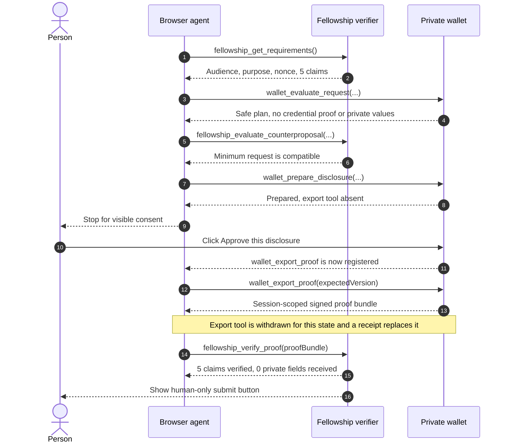
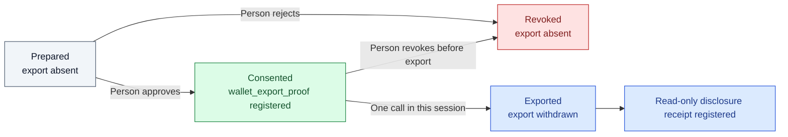
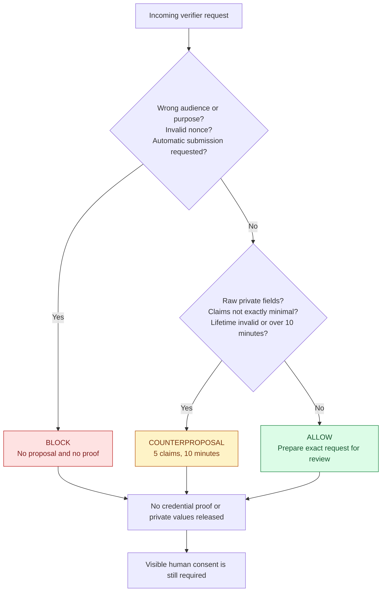

# Proof Courier

[](https://github.com/amanmaqsood/proof-courier/actions/workflows/verify.yml)

> A browser agent can carry enough proof to answer a question without carrying the private records behind it.

[Live product](https://proof-courier-orcin.vercel.app) · [2:45 demo](https://youtu.be/S5y_iFPjlSw) · [Judge evidence room](https://proof-courier-orcin.vercel.app/evidence) · [Devpost submission](https://devpost.com/software/proof-courier)

Proof Courier is a two-origin, shared-artifact WebMCP prototype for minimum, purpose-bound disclosure. A fellowship verifier publishes the five eligibility claims it actually needs. A separate wallet page checks that request, rejects unsafe boundaries, negotiates a smaller alternative when possible, and prepares a signed proof. The person sees the exact disclosure and remains the only one who can approve it. Only then does an atomically claimed export tool become available; its authority survives reload and is shared across same-origin wallet tabs without sending wallet state through the notification channel.

The agent carries the proof to the verifier. It never receives the applicant's date of birth, student ID, exact GPA, transcript, or address. Verification can unlock the final application button, but no agent tool can click it.

| What to open | Link |
| --- | --- |
| Fellowship verifier | [proof-courier-verifier.vercel.app/fellowship](https://proof-courier-verifier.vercel.app/fellowship) |
| Private wallet | [proof-courier-wallet.vercel.app/wallet](https://proof-courier-wallet.vercel.app/wallet) |
| Human-readable release evidence | [proof-courier-orcin.vercel.app/evidence](https://proof-courier-orcin.vercel.app/evidence) |
| Full submitted demo | [youtu.be/S5y_iFPjlSw](https://youtu.be/S5y_iFPjlSw) |

[](https://youtu.be/S5y_iFPjlSw)

## Try the complete journey in about 60 seconds

1. Open the [fellowship verifier](https://proof-courier-verifier.vercel.app/fellowship) and [private wallet](https://proof-courier-wallet.vercel.app/wallet) in separate tabs in a WebMCP-capable browser.
2. Give the browser agent this instruction:

   > Check the fellowship requirements, obtain only the minimum eligibility proof from my wallet, and prepare the application. Stop for my consent and final submission.

3. The agent reads the verifier contract, asks the wallet's Request Firewall to evaluate it, returns the safe request plan to the verifier, and prepares the exact five-claim disclosure.
4. The wallet stops at a visible consent card. At this point, `wallet_export_proof` is absent.
5. Click **Approve this disclosure**. The export tool now appears for one durable, same-origin wallet grant.
6. Continue the agent. It exports the proof in that session, passes the bundle to the verifier, and verifies it.
7. Check both pages: the export tool has been withdrawn from the current in-memory state, privacy-safe receipts are available, and **Submit verified application** remains a human-only button.

The committed native WebMCP receipt records direct capability calls across the two deployed origins. It does not claim that a separate natural-language ChatGPT conversation autonomously selected every step.

## The interaction, end to end



The two pages do not call each other's private APIs. The browser agent is the courier, and the proof bundle returned by one page tool is the only application payload passed to the other page tool.

## Authority is a live capability, not a promise

A confirmation dialog can be ignored by an overpowered agent. Proof Courier changes the tool surface itself. The runtime registers and withdraws tools with `AbortController` as the human-controlled state changes.



This produces the observable capability sequence `0 -> 1 -> 0` from a versioned authorization grant persisted in same-origin IndexedDB:

- before consent, the export tool does not exist;
- after the person approves, it exists for one call in that session;
- after export, it is removed from the current state and replaced by a read-only receipt.

There is deliberately no WebMCP tool that can consent, approve, revoke on the person's behalf, or submit the application.

## The Request Firewall

Before a consent card can even appear, the wallet checks the proposed audience, purpose, nonce, requested claims, requested private fields, lifetime, and any request for automatic submission.



An unsafe verifier boundary is blocked. A request that is negotiable, such as one asking for raw fields or a longer lifetime, receives a machine-readable safe alternative. Every firewall result releases no credential proof and no private values, and every successful preparation still stops for the person.

## What crosses the boundary

| Included in the proof | Kept out of every proof and tool payload |
| --- | --- |
| `age_over_18: true` | Exact date of birth |
| `active_enrollment: true` | Student ID |
| `study_field: computer_science` | Full transcript |
| `gpa_band: 3.5_or_above` | Exact GPA and grades |
| `residency_eligible: true` | Home address |
| Holder public-key binding proof | Holder private signing key |
| Audience, purpose, nonce, issue time, and expiry | Any general wallet-access capability |
| Merkle inclusion paths and issuer/holder signatures | Any consent or application-submission authority |

The bundle is signed Base64url-encoded JSON. The recipient can read the five derived claims. The privacy property comes from minimization, purpose binding, short lifetime, consent, and integrity checks, not from encryption or zero knowledge.

## How the verifier decides

The browser implementation uses Web Crypto and deterministic policy checks:

1. A verifier-pinned demonstration issuer ID and P-256 public key validate the signature over the credential metadata.
2. Merkle inclusion paths prove that each disclosed fixture belongs to the committed credential root.
3. A holder P-256 signature binds the issuer signature, audience, purpose, nonce, timestamps, consent scope, and disclosure set.
4. Exact claim-set checks reject missing claims and over-disclosure.
5. Audience, purpose, timestamp, envelope, and signature checks reject repurposed or altered bundles.
6. `fellowship_get_requirements` issues an unpredictable challenge into the current verifier's in-memory state. Unknown challenges are rejected, and an accepted challenge cannot be verified twice within that active verifier session.

## Proof, not promises

Every result below links to a committed machine-readable receipt.

| Check | Recorded result | Evidence |
| --- | ---: | --- |
| Adversarial policy and cryptographic matrix | 22/22 passed | [scenario-results.json](artifacts/evals/scenario-results.json) |
| Browser checks | 10/10 passed (six product journeys + four durability/concurrency checks) | [verification.json](artifacts/release/verification.json) |
| Direct live tool smoke with GoogleChromeLabs `webmcp-evals` | 5/5 passed, 0 errors | [webmcp-smoke.json](artifacts/evals/third-party/webmcp-smoke.json) |
| Project-run audit with Nekuda WebMCP Workbench tooling | 100/100, 0 findings | [nekuda-wallet-audit.json](artifacts/evals/third-party/nekuda-wallet-audit.json) |
| Local role-build isolation matrix | 21/21 passed: role routes and owner/peer entry chunks | [role-builds.json](artifacts/release/role-builds.json) |
| Canonical browser journey against emitted role artifacts | 1/1 passed against emitted role artifacts | [role-browser.json](artifacts/release/role-browser.json) |
| Protected no-alias Vercel candidates | Passed: role/peer routes, owner/peer chunks, and six security headers | [role-deployment-candidates.json](artifacts/release/role-deployment-candidates.json) |
| Deployed two-origin journey, storage boundary, and peer-fetch checks | Passed | [production-cross-origin.json](artifacts/release/production-cross-origin.json) |
| Native WebMCP consent and capability lifecycle | Passed | [live-webmcp-verification.json](artifacts/release/live-webmcp-verification.json) |

The 22 adversarial scenarios cover valid minimum disclosure, private-value exclusion, wrong audience and purpose, expiry, replay, missing and extra claims, issuer and holder tampering, internal-claim requests, unavailable authority, untrusted issuers, raw-record overreach, automatic submission, excessive lifetime, and altered consent grants.

The full release gate runs:

- lint;
- unit and WebMCP contract tests;
- 22 named adversarial judge scenarios;
- release-copy consistency;
- the TypeScript and Vite production build;
- production-chunk fixture-placement and raw-value scans;
- three independent local role builds with module-graph, secret-content, source-map, route, and entry-chunk isolation checks;
- one complete consent, export, verification, and human-only-final-action browser journey against those emitted role artifacts on three separate processes;
- ten browser checks: six product journeys covering keyboard operation, narrow viewports, the Request Firewall scenario lab, rejected-proof recovery, and automated serious/critical accessibility scans, plus four wallet durability and concurrency checks.

The public [evidence room](https://proof-courier-orcin.vercel.app/evidence) turns those receipts into a judge-readable interface.

## Run it locally

The repository CI uses Node.js 24 and npm.

```bash
git clone https://github.com/amanmaqsood/proof-courier.git
cd proof-courier
npm ci
npm run dev
```

Open:

- `http://localhost:5173/fellowship`
- `http://localhost:5173/wallet`
- `http://localhost:5173/evidence`

This is a convenient same-origin development preview. To exercise the real origin boundary, use the two public deployments or run the Playwright suite, which starts the verifier at port 4173 and the wallet at port 4174.

```bash
npm run e2e
```

Run the complete release gate:

```bash
npm run verify
```

| Command | What it checks |
| --- | --- |
| `npm test` | Domain behavior, proof verification, Request Firewall, and WebMCP contracts |
| `npm run eval` | 22 adversarial scenarios and a machine-readable receipt |
| `npm run eval:webmcp` | Five direct live tool steps with GoogleChromeLabs `webmcp-evals` |
| `npm run build` | TypeScript compilation and production Vite bundles |
| `npm run verify:bundles` | Signing-fixture placement and raw-value absence across production chunks |
| `npm run verify:roles` | Separate wallet, verifier, and showcase artifacts; forbidden module/content scans; simulated-origin 200/404 route and entry-chunk matrix |
| `npm run e2e:roles` | Canonical WebMCP journey against the emitted role artifacts on isolated local processes |
| `npm run e2e` | Ten local browser checks: six product journeys plus four wallet durability/concurrency checks |
| `npm run e2e:production` | Canonical journey against the public wallet and verifier |
| `npm run verify` | The complete local and CI release gate |

## Implementation map

| Area | Source |
| --- | --- |
| Published audience, purpose, and five-claim policy | [`src/domain/proofPolicy.ts`](src/domain/proofPolicy.ts) |
| Request Firewall decisions and safe counterproposal | [`src/domain/requestFirewall.ts`](src/domain/requestFirewall.ts) |
| Proof construction, Merkle fixtures, and encoding | [`src/domain/proofCourier.ts`](src/domain/proofCourier.ts) |
| Canonical signed presentation format | [`src/domain/proofEnvelope.ts`](src/domain/proofEnvelope.ts) |
| Deterministic proof and policy verification | [`src/domain/proofVerifier.ts`](src/domain/proofVerifier.ts) |
| Dynamic wallet tools | [`src/walletWebmcp.ts`](src/walletWebmcp.ts) |
| Dynamic verifier tools | [`src/verifierWebmcp.ts`](src/verifierWebmcp.ts) |
| AbortController-backed capability registration | [`src/webmcpRuntime.ts`](src/webmcpRuntime.ts) |
| Human consent and final-submit controls | [`src/App.tsx`](src/App.tsx) |
| Threats, controls, and residual risks | [`docs/THREAT_MODEL.md`](docs/THREAT_MODEL.md) |
| Evaluation design and reproduction notes | [`docs/EVALS.md`](docs/EVALS.md) |

<details>
<summary>WebMCP tool contract</summary>

### Wallet tools

- `wallet_get_summary`: reads a privacy-safe wallet summary.
- `wallet_evaluate_request`: checks a proposed request and returns block, counterproposal, or allow.
- `wallet_prepare_disclosure`: stages exactly five claims for visible review.
- `wallet_get_disclosure_state`: reads consent and export availability without changing either.
- `wallet_export_proof`: appears after human consent and disappears after one atomic claim across reloads and same-origin wallet tabs.
- `wallet_get_disclosure_receipt`: appears after export and never returns the proof token.

The wallet exposes four base tools. Across the lifecycle, either the export tool or the receipt tool joins that base set.

### Verifier tools

- `fellowship_get_requirements`: publishes the verifier contract and human-only submission boundary.
- `fellowship_evaluate_counterproposal`: checks whether the wallet's safer proposal still satisfies the contract.
- `fellowship_verify_proof`: validates the transported proof without submitting the application.
- `fellowship_get_verification_state`: reads the current result.
- `fellowship_get_verification_receipt`: appears only after an accepted proof.

The verifier exposes four base tools and adds one read-only receipt tool after acceptance.

</details>

## Security boundary

The deployed wallet and verifier are separate origins. The browser suite verifies that wallet local storage is not visible to the verifier and that neither page fetches resources from the peer origin during the tested journey. Production headers configure a same-origin opener policy, deny framing, disable camera, microphone, geolocation, payment, and USB access, use no-referrer behavior, and prevent MIME sniffing.

Both public origins currently serve the same application artifact, including both role routes and lazily loaded role chunks. The legacy build scan proves only that signing fixtures are confined to the wallet-named runtime chunk and that listed raw synthetic record values appear in no production chunk. It does **not** prove role-specific build isolation on the deployed origins: the verifier origin can still serve the wallet route and wallet chunk.

The local release candidate now emits independent wallet, verifier, and showcase artifacts. Its role gate checks the emitted module graphs and content, forbids source maps, serves each artifact on a separate loopback origin, and proves that peer routes and peer entry chunks return 404. Local role builds pass route/chunk isolation. Protected no-alias Vercel candidates from `9183e7a` also pass their route/chunk and six-header matrices, but the canonical public projects have not been cut over; production role isolation remains unproved until those aliases move and the native browser journey is rerun.

The only intended cross-site application payload is the purpose-bound proof that the agent receives from `wallet_export_proof` and supplies to `fellowship_verify_proof`.

## Honest scope

- Every identity, institution, credential, claim, and application is synthetic.
- The demo uses fixed derived-claim, Merkle, and signing fixtures plus masked illustrative fields. It does not derive claims from a real student record.
- One verifier-pinned demonstration issuer key stands in for production trust infrastructure.
- The proof format is signed Base64url JSON. It is not encrypted, a W3C Verifiable Credential, a zero-knowledge proof, or a compliance product.
- The verifier now creates an unpredictable active challenge when `fellowship_get_requirements` runs and rejects caller-chosen, missing, expired, or policy-mismatched challenges. Challenge and replay state still live only in the current verifier's memory; reload, a different tab, or another application instance starts fresh state.
- The wallet authorization grant is persisted in same-origin IndexedDB. Atomic transactions allow one claim across tested reload and cross-tab races; BroadcastChannel carries only a versioned refresh hint, never wallet state. This does not claim cross-device synchronization.
- There is no real university connection, fellowship filing, identity assurance, or production key management.
- The native browser receipt proves direct WebMCP calls and state changes, not autonomous natural-language planning by a separate LLM session.

Those limits are deliberate. The prototype isolates the interaction question: can a browser agent negotiate, obtain, carry, and verify the minimum proof while the person keeps control of disclosure and final action?

## Why this matters

Applications for education, work, housing, finance, and benefits often ask people to upload an entire document when the receiving site needs only a handful of facts. Proof Courier demonstrates a narrower web primitive: sites publish what they require, wallets expose what a person may disclose right now, and an agent coordinates the two without becoming a silent superuser.

The fellowship is one synthetic example. The reusable idea is the authority-aware WebMCP journey.

## License

[MIT](LICENSE)
